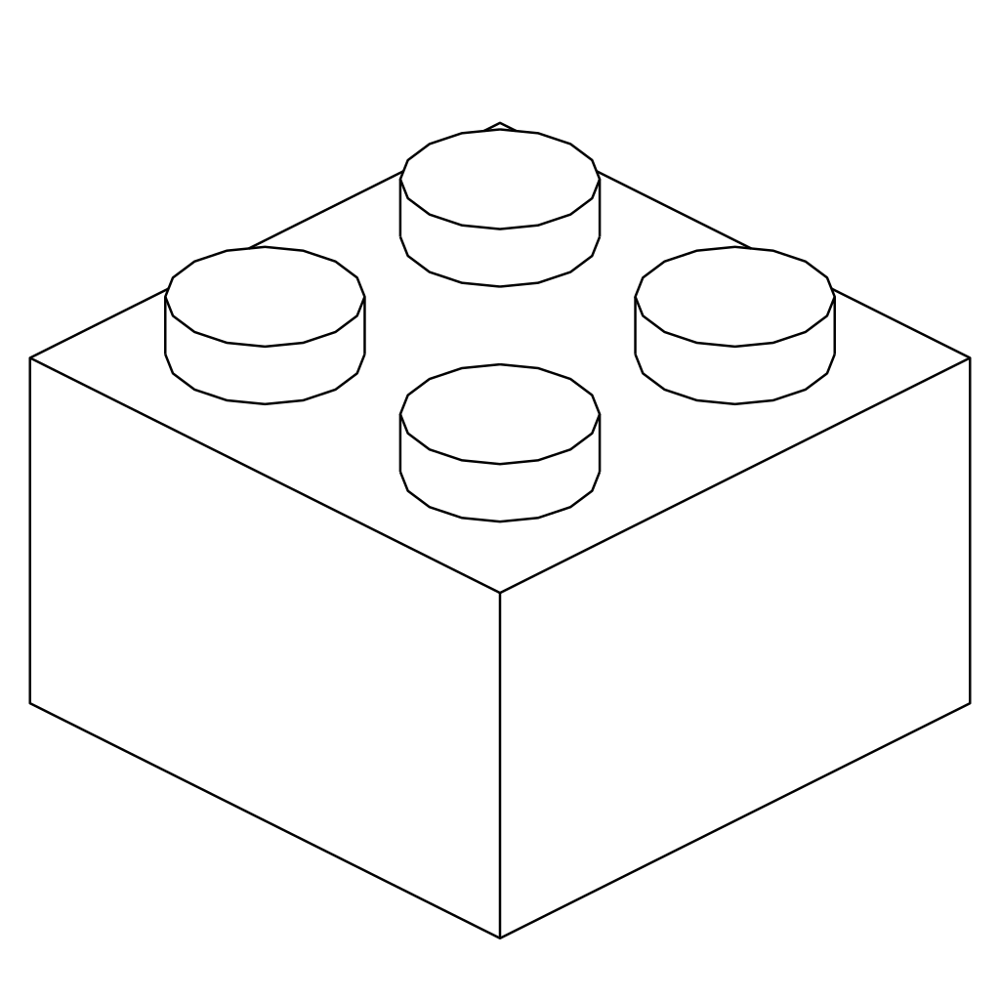
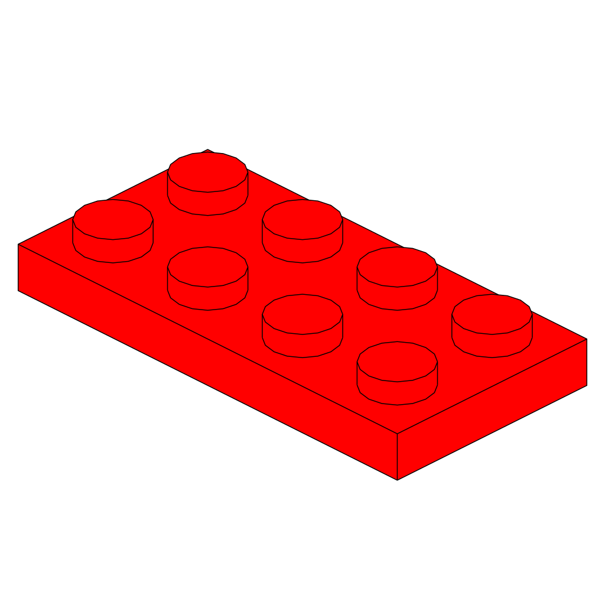
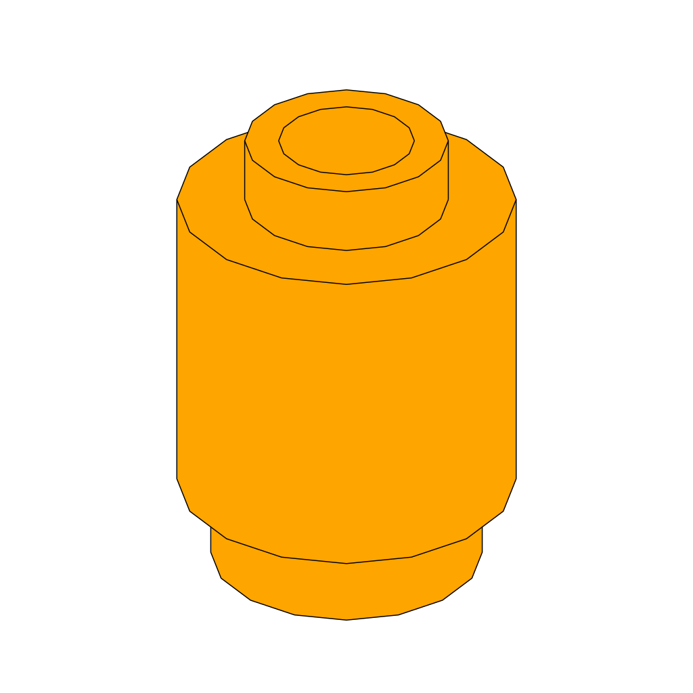
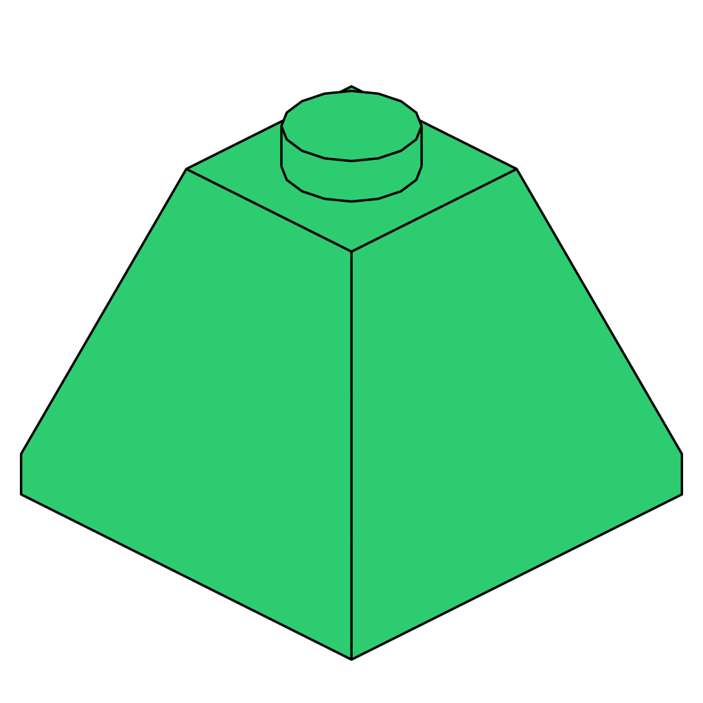
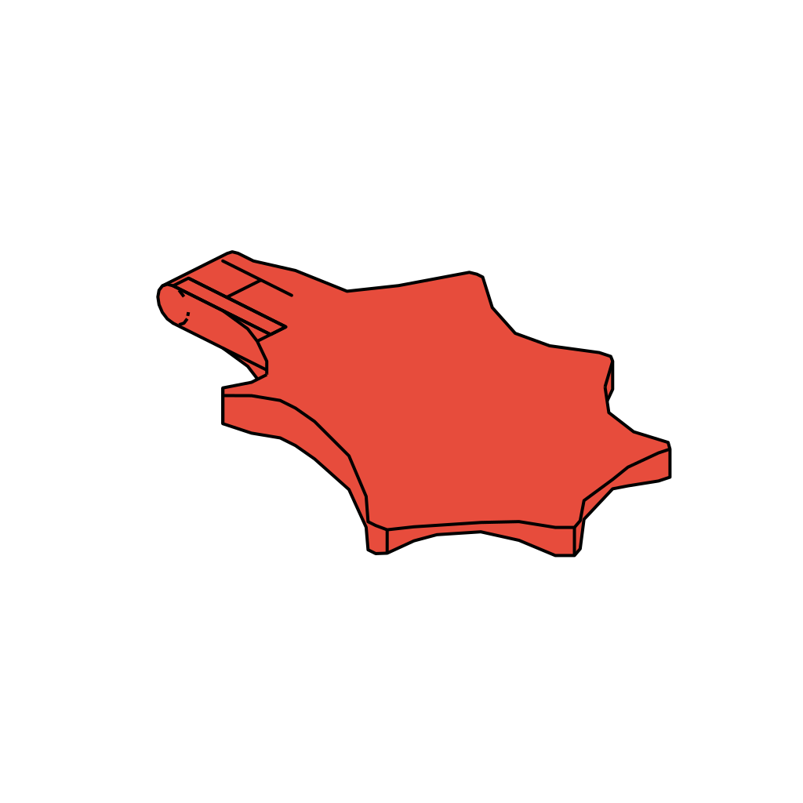

# LEGO Part Renderer

High-performance HTTP API for rendering LDraw LEGO parts as SVG line drawings.

**Built with Go + Blender Freestyle**

## Example Renders

<table>
  <tr>
    <td align="center"><br><b>3001</b><br>Brick 2x4</td>
    <td align="center"><br><b>3003</b><br>Brick 2x2</td>
    <td align="center"><br><b>3024</b><br>Plate 1x1</td>
  </tr>
  <tr>
    <td align="center"><br><b>3022</b><br>Plate 2x2</td>
    <td align="center"><br><b>3020</b><br>Plate 2x4</td>
    <td align="center"><br><b>3039</b><br>Slope 45° 2x2</td>
  </tr>
  <tr>
    <td align="center"><br><b>4286</b><br>Slope 33° 1x3</td>
    <td align="center"><br><b>3062b</b><br>Round Brick 1x1</td>
    <td align="center"><br><b>6141</b><br>Round Plate 1x1</td>
  </tr>
  <tr>
    <td align="center"><br><b>3045</b><br>Double Slope 2x2</td>
    <td align="center"><br><b>6133</b><br>Dragon Wing</td>
    <td align="center"><br><b>4740</b><br>Dish 2x2 Inverted</td>
  </tr>
</table>

## Quick Start

```bash
docker run -d -p 5346:5346 ghcr.io/breckenedge/lego-part-renderer:latest

# Render a part
curl -X POST http://localhost:5346/render \
  -H "Content-Type: application/json" \
  -d '{"partNumber":"3001","thickness":2.0}' \
  --output part.svg

# Render with a custom stroke color
curl -X POST http://localhost:5346/render \
  -H "Content-Type: application/json" \
  -d '{"partNumber":"3024","thickness":2.0,"strokeColor":"cyan"}' \
  --output 3024-cyan.svg
```

## API

### POST /render

Renders an LDraw part as an SVG line drawing.

**Request:**

```json
{
  "partNumber": "3001",
  "thickness": 2.0,
  "fillColor": "currentColor"
}
```

| Field | Type | Required | Default | Description |
|-------|------|----------|---------|-------------|
| `partNumber` | string | yes | | LDraw part number (e.g. `"3001"`, `"3062b"`) |
| `thickness` | float | no | `2.0` | Line thickness in pixels (0.5 - 20.0) |
| `fillColor` | string | no | `white` | Fill color for object shapes (any CSS color value) |
| `strokeColor` | string | no | `currentColor` | Stroke color for lines (any CSS color value) |

The following values are currently hardcoded and not yet configurable via the API ([#2](https://github.com/breckenedge/lego-part-renderer/issues/2)):

| Setting | Value |
|---------|-------|
| Camera latitude | 30° |
| Camera longitude | 45° |
| Resolution | 1024x1024 |
| Camera padding | 0.03 |
| Freestyle crease angle | 135° |

**Response:**

- Content-Type: `image/svg+xml`
- `Cache-Control: public, max-age=31536000, immutable`
- `X-Render-Duration: 6.23s`

**Errors:**

| Status | Cause |
|--------|-------|
| 400 | Missing `partNumber`, invalid JSON, or `thickness` out of range |
| 404 | Part not found in LDraw library |
| 500 | Blender rendering failed or timed out (120s limit) |

### GET /health

```json
{
  "status": "healthy",
  "blender_available": true,
  "ldraw_available": true,
  "temp_dir_writable": true
}
```

### GET /metrics

```json
{
  "renders_total": 142,
  "errors": 3,
  "avg_render_duration_seconds": 6.45
}
```

## Configuration

| Variable | Default | Description |
|----------|---------|-------------|
| `PORT` | `5346` | HTTP port (5346 = LEGO on phone keypad) |
| `LDRAW_PATH` | `/usr/share/ldraw/ldraw` | LDraw library path |

## Architecture

```
┌──────────────────────────────────────────────────┐
│  Docker Container                                │
│                                                  │
│  ┌──────────────┐      ┌─────────────────┐       │
│  │   Go HTTP    │─────>│    Blender      │       │
│  │   Server     │      │  (subprocess)   │       │
│  │   (8MB)      │      │  + Freestyle    │       │
│  └──────────────┘      └─────────────────┘       │
│                                                  │
│  LDraw Library: 12,000+ official part files      │
│                                                  │
└──────────────────────────────────────────────────┘
```

- **Go**: Handles HTTP, validates input, spawns Blender, returns SVG
- **Blender**: Imports LDraw part via ImportLDraw addon, renders with Freestyle
- **LDraw**: 12,000+ official LEGO part geometry definitions

## Performance

| Metric | Value |
|--------|-------|
| HTTP overhead | <5ms |
| Render time | 5-10s (Blender) |
| Memory (idle) | ~4MB |
| Memory (per render) | ~170MB |
| Concurrency | Limited by CPU (1-2 cores per render) |

The bottleneck is Blender rendering, not the Go server. **No GPU required** - the renderer uses Cycles at 1 sample purely to trigger Freestyle edge detection, which is CPU-bound geometry processing. A GPU would add overhead for no gain.

## Building

```bash
git clone https://github.com/breckenedge/lego-part-renderer.git
cd lego-part-renderer
docker build -t lego-renderer .
```

The multi-stage Docker build downloads everything automatically:

1. **Stage 1** (golang:1.22-alpine): Downloads LDraw library (~40MB compressed, ~700MB extracted), clones ImportLDraw addon, builds Go server as a static binary
2. **Stage 2** (ubuntu:22.04): Installs Blender, copies LDraw library and Go binary from stage 1

No manual dependency setup required.

## Testing

Golden file tests render every part in `examples/` and compare the output byte-for-byte against the checked-in SVGs. Since the tests require Blender and the LDraw library, they run inside Docker:

```bash
docker build -f Dockerfile.test -t lego-test .
```

Tests are skipped automatically if Blender isn't available, so `go test ./docker/` is safe to run locally even without Blender installed.

## Deployment

### Docker

```bash
docker run -d \
  --name lego-renderer \
  -p 5346:5346 \
  --restart unless-stopped \
  ghcr.io/breckenedge/lego-part-renderer:latest
```

### Docker Compose

```yaml
services:
  lego-renderer:
    image: ghcr.io/breckenedge/lego-part-renderer:latest
    ports:
      - "5346:5346"
    deploy:
      resources:
        limits:
          cpus: "2"
          memory: 512M
    restart: unless-stopped
```

### Kubernetes

```yaml
apiVersion: apps/v1
kind: Deployment
metadata:
  name: lego-renderer
spec:
  replicas: 3
  template:
    spec:
      containers:
      - name: lego-renderer
        image: ghcr.io/breckenedge/lego-part-renderer:latest
        resources:
          limits: { cpu: "2", memory: "512Mi" }
```

## Caching

The service is stateless and returns `Cache-Control: public, max-age=31536000, immutable` on all renders. Cache at any layer:

- **Reverse proxy** (Nginx) - HTTP response caching
- **CDN** (CloudFlare, Fastly, etc.) - Edge caching
- **Client** - Application-level cache

## Troubleshooting

### Build fails downloading LDraw library

`wget` times out or fails. Check internet connectivity or use a mirror:

```dockerfile
# In Dockerfile, replace:
wget https://library.ldraw.org/library/updates/complete.zip
# With mirror:
wget https://www.ldraw.org/library/updates/complete.zip
```

### Blender addon not found

Rendering fails with "No module named 'ImportLDraw'". Check that ImportLDraw is in `/root/.config/blender/3.0/scripts/addons/ImportLDraw/`. The render script enables addons at runtime via `addon_utils.enable()`.

### Container unhealthy

```bash
docker logs lego-renderer
```

Common causes: Blender not in PATH, LDraw library missing, or temp directory not writable.

### Out of memory

Increase the memory limit. Each concurrent render needs ~170MB:

```yaml
deploy:
  resources:
    limits:
      memory: 2G
```

## License

MIT

## Credits

- [Claude](https://claude.ai/) - Wrote all the code
- [LDraw](https://www.ldraw.org/) - Part library
- [ImportLDraw](https://github.com/TobyLobster/ImportLDraw) - Blender addon
- [Blender](https://www.blender.org/) - 3D rendering
